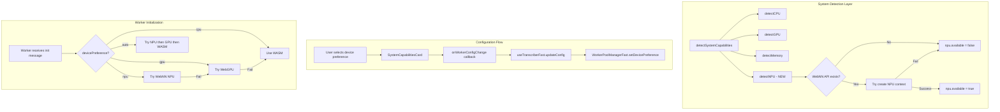

# Experimental NPU Support - Detailed Implementation Specification

## Context

MediaForge is a browser-based video/audio transcription application that runs 100% client-side using Web Workers and Transformers.js. The Fast Mode feature uses parallel workers for transcription acceleration.

Currently, device selection supports:

- **WebGPU** (GPU acceleration) - Primary choice when available
- **WASM** (CPU) - Fallback when GPU unavailable

Modern processors (Intel Core Ultra, Qualcomm Snapdragon X) include NPUs (Neural Processing Units) designed for sustained AI workloads. The WebNN API enables browser access to NPUs.

## Goal

Add **experimental NPU support** via WebNN API, allowing users with compatible hardware to use their NPU for transcription inference. This provides:

- Sustained performance (NPUs don't throttle like GPUs under long loads)
- Lower power consumption
- Frees GPU for other tasks

## Architecture Overview




---

## TASK 1: Add Feature Flag

### File: `lib/featureFlags.ts`

### Context

Feature flags control gradual rollout. NPU support is experimental and should be opt-in.

### What to Implement

Add a new boolean flag `ENABLE_WEBNN_NPU` to the feature flags system.

### Exact Changes

**CHANGE 1.1: Update FeatureFlags interface (line ~10-25)**

BEFORE:

```typescript
export interface FeatureFlags {
  /** Phase 2: Fast Mode UI preset (parallel chunking) */
  ENABLE_FAST_MODE: boolean;
  
  /** Phase 3: Parallel worker processing */
  ENABLE_PARALLEL_WORKERS: boolean;
  
  /** Maximum number of workers for parallel processing */
  MAX_WORKER_COUNT: number;
  
  /** Future: WebGPU acceleration */
  ENABLE_WEBGPU: boolean;
  
  /** Debug: Show performance metrics in UI */
  SHOW_PERF_METRICS: boolean;
}
```

AFTER:

```typescript
export interface FeatureFlags {
  /** Phase 2: Fast Mode UI preset (parallel chunking) */
  ENABLE_FAST_MODE: boolean;
  
  /** Phase 3: Parallel worker processing */
  ENABLE_PARALLEL_WORKERS: boolean;
  
  /** Maximum number of workers for parallel processing */
  MAX_WORKER_COUNT: number;
  
  /** Future: WebGPU acceleration */
  ENABLE_WEBGPU: boolean;
  
  /** Experimental: WebNN NPU acceleration */
  ENABLE_WEBNN_NPU: boolean;
  
  /** Debug: Show performance metrics in UI */
  SHOW_PERF_METRICS: boolean;
}
```

**CHANGE 1.2: Update DEFAULT_FLAGS (line ~34-40)**

BEFORE:

```typescript
export const DEFAULT_FLAGS: FeatureFlags = {
  ENABLE_FAST_MODE: true,
  ENABLE_PARALLEL_WORKERS: true,
  MAX_WORKER_COUNT: 2,
  ENABLE_WEBGPU: false,
  SHOW_PERF_METRICS: false,
};
```

AFTER:

```typescript
export const DEFAULT_FLAGS: FeatureFlags = {
  ENABLE_FAST_MODE: true,
  ENABLE_PARALLEL_WORKERS: true,
  MAX_WORKER_COUNT: 2,
  ENABLE_WEBGPU: false,
  ENABLE_WEBNN_NPU: true,  // Experimental - show NPU option if detected
  SHOW_PERF_METRICS: false,
};
```

### Acceptance Criteria

- `FeatureFlags` interface includes `ENABLE_WEBNN_NPU: boolean`
- `DEFAULT_FLAGS` includes `ENABLE_WEBNN_NPU: true`
- `isFeatureEnabled('ENABLE_WEBNN_NPU')` returns `true` by default
- No TypeScript errors

---

## TASK 2: Add DevicePreference Type

### File: `types/fast-mode.ts`

### Context

Need a type to represent user's device preference for inference acceleration.

### What to Implement

Add a new type alias `DevicePreference` and update `FastModeConfig` interface.

### Exact Changes

**CHANGE 2.1: Add DevicePreference type (after line 11)**

INSERT AFTER `export type TranscriptionMode = 'standard' | 'fast';`:

```typescript

/**
 * Device preference for AI inference acceleration
 * - 'auto': Automatically select best available (NPU > GPU > CPU)
 * - 'npu': Prefer NPU via WebNN (experimental)
 * - 'gpu': Prefer GPU via WebGPU
 * - 'cpu': Use CPU via WASM (most compatible)
 */
export type DevicePreference = 'auto' | 'npu' | 'gpu' | 'cpu';
```

**CHANGE 2.2: Update FastModeConfig interface (line ~86-95)**

BEFORE:

```typescript
export interface FastModeConfig {
  /** Chunk length in seconds (default: 30) */
  chunkLengthSec: number;
  /** Overlap between chunks in seconds (default: 3) */
  overlapSec: number;
  /** Model ID to use (default: distil-whisper/distil-small.en) */
  modelId: string;
  /** Sample rate (fixed at 16000 for Whisper) */
  sampleRate: number;
}
```

AFTER:

```typescript
export interface FastModeConfig {
  /** Chunk length in seconds (default: 30) */
  chunkLengthSec: number;
  /** Overlap between chunks in seconds (default: 3) */
  overlapSec: number;
  /** Model ID to use (default: distil-whisper/distil-small.en) */
  modelId: string;
  /** Sample rate (fixed at 16000 for Whisper) */
  sampleRate: number;
  /** Device preference for inference (default: 'auto') */
  devicePreference: DevicePreference;
}
```

### Acceptance Criteria

- `DevicePreference` type is exported
- `FastModeConfig` includes `devicePreference` field
- No TypeScript errors in files importing from `types/fast-mode.ts`

---

## TASK 3: Add NPU Detection

### File: `utils/systemCapabilities.ts`

### Context

System capabilities detection currently checks CPU, GPU, memory, and browser. Need to add NPU detection via WebNN API.

### What to Implement

1. Extend `SystemCapabilities` interface with `npu` property
2. Add `detectNPU()` async function
3. Update `detectSystemCapabilities()` to call `detectNPU()`
4. Update `WorkerRecommendation` with NPU info
5. Update `calculateOptimalWorkers()` to consider NPU
6. Update `formatCapabilities()` to display NPU info

### Exact Changes

**CHANGE 3.1: Extend SystemCapabilities interface (line ~8-28)**

BEFORE:

```typescript
export interface SystemCapabilities {
  cpu: {
    cores: number;
    threads: number;
    vendor?: string;
  };
  gpu: {
    available: boolean;
    vendor?: string;
    device?: string;
    webgpuSupported: boolean;
  };
  memory: {
    totalGB: number;
    availableGB: number;
  };
  browser: {
    name: string;
    version: string;
  };
}
```

AFTER:

```typescript
export interface SystemCapabilities {
  cpu: {
    cores: number;
    threads: number;
    vendor?: string;
  };
  gpu: {
    available: boolean;
    vendor?: string;
    device?: string;
    webgpuSupported: boolean;
  };
  npu: {
    available: boolean;
    webnnSupported: boolean;
    deviceName?: string;
  };
  memory: {
    totalGB: number;
    availableGB: number;
  };
  browser: {
    name: string;
    version: string;
  };
}
```

**CHANGE 3.2: Extend WorkerRecommendation interface (line ~30-36)**

BEFORE:

```typescript
export interface WorkerRecommendation {
  recommendedWorkers: number;
  maxWorkers: number;
  useGPU: boolean;
  reasoning: string[];
  memoryBudgetMB: number;
}
```

AFTER:

```typescript
export interface WorkerRecommendation {
  recommendedWorkers: number;
  maxWorkers: number;
  useGPU: boolean;
  useNPU: boolean;
  preferredDevice: 'npu' | 'gpu' | 'cpu';
  reasoning: string[];
  memoryBudgetMB: number;
}
```

**CHANGE 3.3: Update detectSystemCapabilities function (line ~41-50)**

BEFORE:

```typescript
export async function detectSystemCapabilities(): Promise<SystemCapabilities> {
  const capabilities: SystemCapabilities = {
    cpu: await detectCPU(),
    gpu: await detectGPU(),
    memory: await detectMemory(),
    browser: detectBrowser(),
  };

  return capabilities;
}
```

AFTER:

```typescript
export async function detectSystemCapabilities(): Promise<SystemCapabilities> {
  const capabilities: SystemCapabilities = {
    cpu: await detectCPU(),
    gpu: await detectGPU(),
    npu: await detectNPU(),
    memory: await detectMemory(),
    browser: detectBrowser(),
  };

  return capabilities;
}
```

**CHANGE 3.4: Add detectNPU function (INSERT AFTER detectGPU function, around line 135)**

INSERT THIS NEW FUNCTION:

```typescript
/**
 * Detect NPU (Neural Processing Unit) via WebNN API
 * 
 * WebNN is experimental and requires:
 * - Windows 11 24H2+ or compatible OS
 * - Chrome/Edge with #enable-webnn flag
 * - NPU drivers installed
 */
async function detectNPU(): Promise<SystemCapabilities['npu']> {
  let webnnSupported = false;
  let available = false;
  let deviceName: string | undefined;

  // Check if WebNN API exists
  // @ts-ignore - navigator.ml is experimental
  if ('ml' in navigator && navigator.ml) {
    webnnSupported = true;
    
    try {
      // Try to create an NPU context to verify NPU availability
      // @ts-ignore - navigator.ml is experimental
      const context = await navigator.ml.createContext({ deviceType: 'npu' });
      
      if (context) {
        available = true;
        deviceName = 'WebNN NPU';
        
        // Try to get more device info if available
        // @ts-ignore - experimental API
        if (context.deviceType) {
          deviceName = `WebNN NPU (${context.deviceType})`;
        }
        
        console.log('[SystemCapabilities] NPU detected via WebNN');
      }
    } catch (error) {
      // NPU not available or WebNN NPU backend not supported
      console.log('[SystemCapabilities] WebNN available but NPU not accessible:', error);
      
      // Check if at least GPU backend works via WebNN
      try {
        // @ts-ignore - navigator.ml is experimental
        const gpuContext = await navigator.ml.createContext({ deviceType: 'gpu' });
        if (gpuContext) {
          console.log('[SystemCapabilities] WebNN GPU backend available (no NPU)');
        }
      } catch {
        // WebNN exists but no backends work
      }
    }
  } else {
    console.log('[SystemCapabilities] WebNN API not available');
  }

  return {
    available,
    webnnSupported,
    deviceName,
  };
}
```

**CHANGE 3.5: Update calculateOptimalWorkers return statement (around line 329-339)**

FIND THIS SECTION:

```typescript
  reasoning.push(`Final recommendation: ${recommendedWorkers} workers (max: ${maxWorkers})`);
  reasoning.push(`Memory budget: ${(memoryBudgetMB / 1024).toFixed(1)}GB`);

  return {
    recommendedWorkers,
    maxWorkers,
    useGPU,
    reasoning,
    memoryBudgetMB,
  };
}
```

REPLACE WITH:

```typescript
  // Determine preferred device
  let preferredDevice: 'npu' | 'gpu' | 'cpu' = 'cpu';
  const useNPU = capabilities.npu.available;
  
  if (useNPU) {
    preferredDevice = 'npu';
    reasoning.push(`NPU detected - WebNN NPU acceleration available (experimental)`);
  } else if (useGPU) {
    preferredDevice = 'gpu';
  }

  reasoning.push(`Final recommendation: ${recommendedWorkers} workers (max: ${maxWorkers})`);
  reasoning.push(`Preferred device: ${preferredDevice.toUpperCase()}`);
  reasoning.push(`Memory budget: ${(memoryBudgetMB / 1024).toFixed(1)}GB`);

  return {
    recommendedWorkers,
    maxWorkers,
    useGPU,
    useNPU,
    preferredDevice,
    reasoning,
    memoryBudgetMB,
  };
}
```

**CHANGE 3.6: Update formatCapabilities function (line ~344-366)**

BEFORE:

```typescript
export function formatCapabilities(capabilities: SystemCapabilities): string {
  const lines: string[] = [];
  
  lines.push(`CPU: ${capabilities.cpu.threads} threads (${capabilities.cpu.cores} cores)`);
  if (capabilities.cpu.vendor) {
    lines.push(`  Vendor: ${capabilities.cpu.vendor}`);
  }
  
  lines.push(`GPU: ${capabilities.gpu.available ? 'Available' : 'Not detected'}`);
  if (capabilities.gpu.vendor) {
    lines.push(`  Vendor: ${capabilities.gpu.vendor}`);
  }
  if (capabilities.gpu.device) {
    lines.push(`  Device: ${capabilities.gpu.device}`);
  }
  lines.push(`  WebGPU: ${capabilities.gpu.webgpuSupported ? 'Supported ✓' : 'Not supported'}`);
  
  lines.push(`Memory: ${capabilities.memory.totalGB}GB total (${capabilities.memory.availableGB.toFixed(1)}GB available)`);
  
  lines.push(`Browser: ${capabilities.browser.name} ${capabilities.browser.version}`);
  
  return lines.join('\n');
}
```

AFTER:

```typescript
export function formatCapabilities(capabilities: SystemCapabilities): string {
  const lines: string[] = [];
  
  lines.push(`CPU: ${capabilities.cpu.threads} threads (${capabilities.cpu.cores} cores)`);
  if (capabilities.cpu.vendor) {
    lines.push(`  Vendor: ${capabilities.cpu.vendor}`);
  }
  
  lines.push(`GPU: ${capabilities.gpu.available ? 'Available' : 'Not detected'}`);
  if (capabilities.gpu.vendor) {
    lines.push(`  Vendor: ${capabilities.gpu.vendor}`);
  }
  if (capabilities.gpu.device) {
    lines.push(`  Device: ${capabilities.gpu.device}`);
  }
  lines.push(`  WebGPU: ${capabilities.gpu.webgpuSupported ? 'Supported ✓' : 'Not supported'}`);
  
  lines.push(`NPU: ${capabilities.npu.available ? 'Available ✓' : 'Not detected'}`);
  if (capabilities.npu.deviceName) {
    lines.push(`  Device: ${capabilities.npu.deviceName}`);
  }
  lines.push(`  WebNN: ${capabilities.npu.webnnSupported ? 'Supported' : 'Not supported'}`);
  
  lines.push(`Memory: ${capabilities.memory.totalGB}GB total (${capabilities.memory.availableGB.toFixed(1)}GB available)`);
  
  lines.push(`Browser: ${capabilities.browser.name} ${capabilities.browser.version}`);
  
  return lines.join('\n');
}
```

### Acceptance Criteria

- `SystemCapabilities` interface has `npu` property with `available`, `webnnSupported`, `deviceName`
- `WorkerRecommendation` interface has `useNPU`, `preferredDevice` properties
- `detectNPU()` function exists and returns correct structure
- `detectSystemCapabilities()` calls `detectNPU()`
- `calculateOptimalWorkers()` returns `useNPU` and `preferredDevice`
- `formatCapabilities()` displays NPU information
- No TypeScript errors
- Console logs NPU detection status

---

## TASK 4: Update Worker for WebNN NPU Support

### File: `public/transcriber-fast.worker.js`

### Context

The worker currently detects WebGPU or falls back to WASM. Need to add WebNN NPU as an option.

### What to Implement

1. Update `detectBestDevice()` to accept device preference parameter
2. Add WebNN NPU detection logic
3. Update `initialize()` to accept and use device preference
4. Update message handler to pass device preference

### Exact Changes

**CHANGE 4.1: Replace detectBestDevice function (line ~32-51)**

BEFORE:

```javascript
/**
 * Detect best available device (WebGPU > WASM)
 */
async function detectBestDevice() {
  try {
    // Check if WebGPU is available
    if ('gpu' in navigator) {
      const adapter = await navigator.gpu.requestAdapter();
      if (adapter) {
        console.log('[FastWorker] WebGPU available - using GPU acceleration');
        return 'webgpu';
      }
    }
  } catch (error) {
    console.warn('[FastWorker] WebGPU not available:', error);
  }
  
  console.log('[FastWorker] Falling back to WASM (CPU)');
  return 'wasm';
}
```

AFTER:

```javascript
/**
 * Detect best available device based on preference
 * Fallback chain: NPU -> GPU -> CPU
 * 
 * @param {string} preference - 'auto' | 'npu' | 'gpu' | 'cpu'
 * @returns {Promise<{device: string, deviceType?: string}>}
 */
async function detectBestDevice(preference = 'auto') {
  console.log(`[FastWorker] Detecting best device (preference: ${preference})`);
  
  // If user explicitly wants CPU, skip detection
  if (preference === 'cpu') {
    console.log('[FastWorker] User preference: CPU (WASM)');
    return { device: 'wasm' };
  }
  
  // Try NPU via WebNN (if preference is 'npu' or 'auto')
  if (preference === 'npu' || preference === 'auto') {
    try {
      if ('ml' in navigator && navigator.ml) {
        const context = await navigator.ml.createContext({ deviceType: 'npu' });
        if (context) {
          console.log('[FastWorker] WebNN NPU available - using NPU acceleration');
          return { device: 'webnn', deviceType: 'npu' };
        }
      }
    } catch (error) {
      console.warn('[FastWorker] WebNN NPU not available:', error);
    }
  }
  
  // If user explicitly wanted NPU but it's not available, warn and continue
  if (preference === 'npu') {
    console.warn('[FastWorker] NPU requested but not available, falling back to GPU');
  }
  
  // Try GPU via WebGPU (if preference is 'gpu' or 'auto' or NPU failed)
  if (preference !== 'cpu') {
    try {
      if ('gpu' in navigator) {
        const adapter = await navigator.gpu.requestAdapter();
        if (adapter) {
          console.log('[FastWorker] WebGPU available - using GPU acceleration');
          return { device: 'webgpu' };
        }
      }
    } catch (error) {
      console.warn('[FastWorker] WebGPU not available:', error);
    }
  }
  
  // Fallback to WASM (CPU)
  console.log('[FastWorker] Falling back to WASM (CPU)');
  return { device: 'wasm' };
}
```

**CHANGE 4.2: Update initialize function signature (line ~72)**

BEFORE:

```javascript
async function initialize(requestId, modelId) {
```

AFTER:

```javascript
async function initialize(requestId, modelId, devicePreference = 'auto') {
```

**CHANGE 4.3: Update device detection call in initialize (around line ~76-77)**

BEFORE:

```javascript
    console.log(`[FastWorker] Initializing worker, loading model: ${currentModelId}`);
    
    // Send initial progress
```

AFTER:

```javascript
    console.log(`[FastWorker] Initializing worker, loading model: ${currentModelId}`);
    console.log(`[FastWorker] Device preference: ${devicePreference}`);
    
    // Send initial progress
```

**CHANGE 4.4: Update device detection and pipeline creation (around line ~90-113)**

FIND:

```javascript
    // Try WebGPU first for GPU acceleration, fallback to WASM
    const device = await detectBestDevice();
    console.log(`[FastWorker] Using device: ${device}`);
```

REPLACE WITH:

```javascript
    // Detect best device based on user preference
    const deviceConfig = await detectBestDevice(devicePreference);
    console.log(`[FastWorker] Using device: ${deviceConfig.device}${deviceConfig.deviceType ? ` (${deviceConfig.deviceType})` : ''}`);
```

**CHANGE 4.5: Update pipeline options (around line ~91-113)**

FIND the pipeline creation section and REPLACE it entirely:

BEFORE:

```javascript
    transcriber = await pipeline(
      'automatic-speech-recognition',
      currentModelId,
      {
        quantized: true,
        device: device, // 'webgpu' for GPU, 'wasm' for CPU fallback
        progress_callback: (progress) => {
          // Forward model loading progress
          self.postMessage({
            type: 'download-progress',
            requestId,
            data: {
              status: progress.status || 'progress',
              name: currentModelId,
              file: progress.file || 'model',
              progress: progress.progress || 0,
              loaded: progress.loaded || 0,
              total: progress.total || 0,
            },
          });
        },
      }
    );
```

AFTER:

```javascript
    // Build pipeline options based on device config
    const pipelineOptions = {
      quantized: true,
      progress_callback: (progress) => {
        // Forward model loading progress
        self.postMessage({
          type: 'download-progress',
          requestId,
          data: {
            status: progress.status || 'progress',
            name: currentModelId,
            file: progress.file || 'model',
            progress: progress.progress || 0,
            loaded: progress.loaded || 0,
            total: progress.total || 0,
          },
        });
      },
    };
    
    // Set device configuration
    if (deviceConfig.device === 'webnn') {
      // WebNN with specific device type (npu or gpu)
      pipelineOptions.device = 'webnn';
      if (deviceConfig.deviceType) {
        pipelineOptions.deviceType = deviceConfig.deviceType;
      }
    } else {
      // WebGPU or WASM
      pipelineOptions.device = deviceConfig.device;
    }
    
    console.log(`[FastWorker] Creating pipeline with options:`, { 
      device: pipelineOptions.device, 
      deviceType: pipelineOptions.deviceType 
    });
    
    transcriber = await pipeline(
      'automatic-speech-recognition',
      currentModelId,
      pipelineOptions
    );
```

**CHANGE 4.6: Update message handler to extract devicePreference (around line ~261)**

BEFORE:

```javascript
self.onmessage = async (event) => {
  const { type, requestId, modelId, chunkIndex, audioData, startOffset, endOffset } = event.data;
```

AFTER:

```javascript
self.onmessage = async (event) => {
  const { type, requestId, modelId, devicePreference, chunkIndex, audioData, startOffset, endOffset } = event.data;
```

**CHANGE 4.7: Update init case to pass devicePreference (around line ~266-268)**

BEFORE:

```javascript
      case 'init':
        // Accepts modelId and devicePreference parameters
        await initialize(requestId, modelId);
        break;
```

AFTER:

```javascript
      case 'init':
        // Accepts modelId and devicePreference parameters
        await initialize(requestId, modelId, devicePreference);
        break;
```

### Acceptance Criteria

- `detectBestDevice()` accepts `preference` parameter
- WebNN NPU detection is attempted when preference is 'npu' or 'auto'
- Fallback chain works: NPU -> GPU -> CPU
- `initialize()` accepts `devicePreference` parameter
- Pipeline options correctly set `device` and `deviceType` for WebNN
- Message handler extracts and passes `devicePreference`
- Console logs show device detection process

---

## TASK 5: Add devicePreference to WorkerPoolManagerFast

### File: `services/fast-mode/WorkerPoolManagerFast.ts`

### Context

The worker pool manager initializes workers and needs to pass device preference to each worker.

### What to Implement

1. Add `devicePreference` property
2. Add `setDevicePreference()` method
3. Update `initWorker()` to pass device preference in init message

### Exact Changes

**CHANGE 5.1: Add import for DevicePreference type (line 8)**

BEFORE:

```typescript
import type { AudioChunk, ChunkResult, WorkerPoolConfig, WorkerPoolStatus, WorkerStatus } from '@/types/fast-mode';
```

AFTER:

```typescript
import type { AudioChunk, ChunkResult, WorkerPoolConfig, WorkerPoolStatus, WorkerStatus, DevicePreference } from '@/types/fast-mode';
```

**CHANGE 5.2: Add devicePreference property (after line 36)**

FIND:

```typescript
  private modelId: string = 'distil-whisper/distil-small.en';

  constructor(config: Partial<WorkerPoolConfig> = {}, progressCallback?: (progress: any) => void) {
```

REPLACE WITH:

```typescript
  private modelId: string = 'distil-whisper/distil-small.en';
  private devicePreference: DevicePreference = 'auto';

  constructor(config: Partial<WorkerPoolConfig> = {}, progressCallback?: (progress: any) => void) {
```

**CHANGE 5.3: Add setDevicePreference and getDevicePreference methods (after getModelId, around line 58)**

FIND:

```typescript
  /**
   * Get the current model ID
   */
  getModelId(): string {
    return this.modelId;
  }

  /**
   * Initialize worker pool
```

REPLACE WITH:

```typescript
  /**
   * Get the current model ID
   */
  getModelId(): string {
    return this.modelId;
  }

  /**
   * Set the device preference for inference
   * @param preference - 'auto' | 'npu' | 'gpu' | 'cpu'
   */
  setDevicePreference(preference: DevicePreference): void {
    this.devicePreference = preference;
    console.log(`[WorkerPool] Device preference set to: ${preference}`);
  }

  /**
   * Get the current device preference
   */
  getDevicePreference(): DevicePreference {
    return this.devicePreference;
  }

  /**
   * Initialize worker pool
```

**CHANGE 5.4: Update initWorker to pass devicePreference (around line 107-112)**

FIND:

```typescript
      // Pass modelId to worker for initialization
      worker.postMessage({
        type: 'init',
        requestId,
        modelId: this.modelId,
      });
```

REPLACE WITH:

```typescript
      // Pass modelId and devicePreference to worker for initialization
      worker.postMessage({
        type: 'init',
        requestId,
        modelId: this.modelId,
        devicePreference: this.devicePreference,
      });
```

### Acceptance Criteria

- `DevicePreference` type is imported
- `devicePreference` private property exists with default 'auto'
- `setDevicePreference()` method exists and logs the change
- `getDevicePreference()` method exists
- `initWorker()` passes `devicePreference` in the init message
- No TypeScript errors

---

## TASK 6: Extend useTranscriberFast Hook

### File: `hooks/useTranscriberFast.ts`

### Context

The hook orchestrates Fast Mode and needs to accept and propagate device preference.

### What to Implement

1. Add `devicePreference` to config interface
2. Import `DevicePreference` type
3. Pass device preference to worker pool during initialization

### Exact Changes

**CHANGE 6.1: Add DevicePreference import (line 9)**

BEFORE:

```typescript
import type { FastModeProgress, FastModeTranscriptionResult } from '@/types/fast-mode';
```

AFTER:

```typescript
import type { FastModeProgress, FastModeTranscriptionResult, DevicePreference } from '@/types/fast-mode';
```

**CHANGE 6.2: Update UseTranscriberFastConfig interface (line 17-24)**

BEFORE:

```typescript
export interface UseTranscriberFastConfig {
  /** Number of parallel workers (default: auto-detect) */
  maxWorkers?: number;
  /** Memory budget in MB (default: auto-calculate) */
  memoryBudgetMB?: number;
  /** Model ID to use for transcription (default: distil-whisper/distil-small.en) */
  modelId?: string;
}
```

AFTER:

```typescript
export interface UseTranscriberFastConfig {
  /** Number of parallel workers (default: auto-detect) */
  maxWorkers?: number;
  /** Memory budget in MB (default: auto-calculate) */
  memoryBudgetMB?: number;
  /** Model ID to use for transcription (default: distil-whisper/distil-small.en) */
  modelId?: string;
  /** Device preference for inference (default: 'auto') */
  devicePreference?: DevicePreference;
}
```

**CHANGE 6.3: Update initializeServices to set device preference (around line 115-120)**

FIND:

```typescript
    // Set the model ID before initialization
    const modelId = config.modelId || 'distil-whisper/distil-small.en';
    workerPoolRef.current.setModelId(modelId);

    processorRef.current = new ParallelChunkProcessorFast(workerPoolRef.current);
```

REPLACE WITH:

```typescript
    // Set the model ID before initialization
    const modelId = config.modelId || 'distil-whisper/distil-small.en';
    workerPoolRef.current.setModelId(modelId);

    // Set the device preference before initialization
    const devicePreference = config.devicePreference || 'auto';
    workerPoolRef.current.setDevicePreference(devicePreference);
    
    console.log(`[useTranscriberFast] Device preference: ${devicePreference}`);

    processorRef.current = new ParallelChunkProcessorFast(workerPoolRef.current);
```

### Acceptance Criteria

- `DevicePreference` type is imported
- `UseTranscriberFastConfig` includes `devicePreference?: DevicePreference`
- `initializeServices` calls `setDevicePreference()` on worker pool
- Console logs device preference
- No TypeScript errors

---

## TASK 7: Update SystemCapabilitiesCard UI

### File: `components/fast-mode/SystemCapabilitiesCard.tsx`

### Context

The UI card displays system capabilities and allows worker configuration. Need to add NPU display and device preference selector.

### What to Implement

1. Import `DevicePreference` type and feature flag check
2. Add state for device preference
3. Display NPU status badge
4. Add device preference radio buttons
5. Update callback to include device preference

### Exact Changes

**CHANGE 7.1: Update imports (line 1-15)**

BEFORE:

```typescript
'use client';

import { useEffect, useState } from 'react';
import { Card, CardContent, CardDescription, CardHeader, CardTitle } from '@/components/ui/card';
import { Badge } from '@/components/ui/badge';
import { Button } from '@/components/ui/button';
import { Slider } from '@/components/ui/slider';
import { 
  detectSystemCapabilities, 
  calculateOptimalWorkers,
  formatCapabilities,
  type SystemCapabilities,
  type WorkerRecommendation 
} from '@/utils/systemCapabilities';
import { Cpu, Zap, HardDrive, Chrome, Info, Settings } from 'lucide-react';
```

AFTER:

```typescript
'use client';

import { useEffect, useState } from 'react';
import { Card, CardContent, CardDescription, CardHeader, CardTitle } from '@/components/ui/card';
import { Badge } from '@/components/ui/badge';
import { Button } from '@/components/ui/button';
import { Slider } from '@/components/ui/slider';
import { 
  detectSystemCapabilities, 
  calculateOptimalWorkers,
  formatCapabilities,
  type SystemCapabilities,
  type WorkerRecommendation 
} from '@/utils/systemCapabilities';
import { isFeatureEnabled } from '@/lib/featureFlags';
import type { DevicePreference } from '@/types/fast-mode';
import { Cpu, Zap, HardDrive, Chrome, Info, Settings, Sparkles } from 'lucide-react';
```

**CHANGE 7.2: Update props interface (line 23-26)**

BEFORE:

```typescript
interface SystemCapabilitiesCardProps {
  onWorkerConfigChange?: (config: { workers: number; useGPU: boolean; memoryBudgetMB: number }) => void;
  initialWorkers?: number;
}
```

AFTER:

```typescript
interface SystemCapabilitiesCardProps {
  onWorkerConfigChange?: (config: { 
    workers: number; 
    useGPU: boolean; 
    memoryBudgetMB: number;
    devicePreference: DevicePreference;
  }) => void;
  initialWorkers?: number;
  initialDevicePreference?: DevicePreference;
}
```

**CHANGE 7.3: Update component function signature and add state (line 28-36)**

BEFORE:

```typescript
export function SystemCapabilitiesCard({ 
  onWorkerConfigChange,
  initialWorkers 
}: SystemCapabilitiesCardProps) {
  const [capabilities, setCapabilities] = useState<SystemCapabilities | null>(null);
  const [recommendation, setRecommendation] = useState<WorkerRecommendation | null>(null);
  const [selectedWorkers, setSelectedWorkers] = useState<number>(initialWorkers || 2);
  const [isDetecting, setIsDetecting] = useState(false);
  const [showDetails, setShowDetails] = useState(false);
```

AFTER:

```typescript
export function SystemCapabilitiesCard({ 
  onWorkerConfigChange,
  initialWorkers,
  initialDevicePreference = 'auto'
}: SystemCapabilitiesCardProps) {
  const [capabilities, setCapabilities] = useState<SystemCapabilities | null>(null);
  const [recommendation, setRecommendation] = useState<WorkerRecommendation | null>(null);
  const [selectedWorkers, setSelectedWorkers] = useState<number>(initialWorkers || 2);
  const [selectedDevice, setSelectedDevice] = useState<DevicePreference>(initialDevicePreference);
  const [isDetecting, setIsDetecting] = useState(false);
  const [showDetails, setShowDetails] = useState(false);
  
  const npuFeatureEnabled = isFeatureEnabled('ENABLE_WEBNN_NPU');
```

**CHANGE 7.4: Update detectCapabilities callback (line 52-59)**

BEFORE:

```typescript
      // Notify parent of recommended config
      if (onWorkerConfigChange) {
        onWorkerConfigChange({
          workers: rec.recommendedWorkers,
          useGPU: rec.useGPU,
          memoryBudgetMB: rec.memoryBudgetMB,
        });
      }
```

AFTER:

```typescript
      // Set initial device preference based on recommendation
      const initialDevice = rec.preferredDevice === 'npu' && npuFeatureEnabled ? 'npu' : 
                           rec.preferredDevice === 'gpu' ? 'gpu' : 'auto';
      setSelectedDevice(initialDevice);
      
      // Notify parent of recommended config
      if (onWorkerConfigChange) {
        onWorkerConfigChange({
          workers: rec.recommendedWorkers,
          useGPU: rec.useGPU,
          memoryBudgetMB: rec.memoryBudgetMB,
          devicePreference: initialDevice,
        });
      }
```

**CHANGE 7.5: Update handleWorkerChange and add handleDeviceChange (line 67-78)**

BEFORE:

```typescript
  const handleWorkerChange = (value: number[]) => {
    const workers = value[0];
    setSelectedWorkers(workers);

    if (onWorkerConfigChange && recommendation) {
      onWorkerConfigChange({
        workers,
        useGPU: recommendation.useGPU,
        memoryBudgetMB: workers * 600 + 1000,
      });
    }
  };
```

AFTER:

```typescript
  const handleWorkerChange = (value: number[]) => {
    const workers = value[0];
    setSelectedWorkers(workers);

    if (onWorkerConfigChange && recommendation) {
      onWorkerConfigChange({
        workers,
        useGPU: recommendation.useGPU,
        memoryBudgetMB: workers * 600 + 1000,
        devicePreference: selectedDevice,
      });
    }
  };

  const handleDeviceChange = (device: DevicePreference) => {
    setSelectedDevice(device);

    if (onWorkerConfigChange && recommendation) {
      onWorkerConfigChange({
        workers: selectedWorkers,
        useGPU: device === 'gpu' || (device === 'auto' && recommendation.useGPU),
        memoryBudgetMB: selectedWorkers * 600 + 1000,
        devicePreference: device,
      });
    }
  };
```

**CHANGE 7.6: Add NPU display in Quick Summary grid (after GPU section, around line 127)**

INSERT AFTER the GPU section (the div with "GPU Ready" or "CPU Only"):

```typescript
          {/* NPU - Only show if feature enabled */}
          {npuFeatureEnabled && (
            <div className="flex flex-col items-center p-3 bg-muted rounded-lg">
              <Sparkles className="h-5 w-5 mb-2 text-muted-foreground" />
              <div className="text-2xl font-bold">
                {capabilities.npu.available ? '✓' : '✗'}
              </div>
              <div className="text-xs text-muted-foreground">
                {capabilities.npu.available ? 'NPU Ready' : 'No NPU'}
              </div>
            </div>
          )}
```

**CHANGE 7.7: Add NPU Badge (after GPU Badge section, around line 157)**

INSERT AFTER the GPU Badge section:

```typescript
        {/* NPU Badge */}
        {npuFeatureEnabled && capabilities.npu.available && (
          <div className="flex items-center gap-2">
            <Badge variant="default" className="bg-purple-500">
              <Sparkles className="h-3 w-3 mr-1" />
              NPU Available
            </Badge>
            <Badge variant="outline" className="text-amber-500 border-amber-500">
              Experimental
            </Badge>
            {capabilities.npu.deviceName && (
              <span className="text-sm text-muted-foreground">
                {capabilities.npu.deviceName}
              </span>
            )}
          </div>
        )}
```

**CHANGE 7.8: Add Device Preference Selector (before Memory Estimate, around line 182)**

INSERT BEFORE the Memory Estimate div:

```typescript
        {/* Device Preference Selector */}
        <div className="space-y-2">
          <label className="text-sm font-medium">Inference Device</label>
          <div className="flex flex-wrap gap-2">
            <Button
              variant={selectedDevice === 'auto' ? 'default' : 'outline'}
              size="sm"
              onClick={() => handleDeviceChange('auto')}
            >
              Auto
            </Button>
            {capabilities.gpu.webgpuSupported && (
              <Button
                variant={selectedDevice === 'gpu' ? 'default' : 'outline'}
                size="sm"
                onClick={() => handleDeviceChange('gpu')}
              >
                <Zap className="h-3 w-3 mr-1" />
                GPU
              </Button>
            )}
            {npuFeatureEnabled && capabilities.npu.available && (
              <Button
                variant={selectedDevice === 'npu' ? 'default' : 'outline'}
                size="sm"
                onClick={() => handleDeviceChange('npu')}
                className={selectedDevice === 'npu' ? 'bg-purple-500 hover:bg-purple-600' : ''}
              >
                <Sparkles className="h-3 w-3 mr-1" />
                NPU
                <Badge variant="outline" className="ml-1 text-[10px] px-1 py-0">Beta</Badge>
              </Button>
            )}
            <Button
              variant={selectedDevice === 'cpu' ? 'default' : 'outline'}
              size="sm"
              onClick={() => handleDeviceChange('cpu')}
            >
              CPU
            </Button>
          </div>
          <p className="text-xs text-muted-foreground">
            {selectedDevice === 'auto' && 'Automatically select the best available device'}
            {selectedDevice === 'gpu' && 'Use GPU via WebGPU for acceleration'}
            {selectedDevice === 'npu' && 'Use NPU via WebNN (experimental, may not work on all systems)'}
            {selectedDevice === 'cpu' && 'Use CPU via WebAssembly (most compatible)'}
          </p>
        </div>

```

**CHANGE 7.9: Update Details section to show NPU info (around line 218)**

FIND:

```typescript
                <div>  WebGPU: {capabilities.gpu.webgpuSupported ? 'Supported ✓' : 'Not supported'}</div>
                <div>Memory: {capabilities.memory.totalGB}GB total
```

INSERT BETWEEN these lines:

```typescript
                <div>  WebGPU: {capabilities.gpu.webgpuSupported ? 'Supported ✓' : 'Not supported'}</div>
                <div>NPU: {capabilities.npu.available ? 'Available ✓' : 'Not detected'}</div>
                {capabilities.npu.deviceName && (
                  <div>  Device: {capabilities.npu.deviceName}</div>
                )}
                <div>  WebNN: {capabilities.npu.webnnSupported ? 'Supported' : 'Not supported'}</div>
                <div>Memory: {capabilities.memory.totalGB}GB total
```

### Acceptance Criteria

- `DevicePreference` type and `isFeatureEnabled` are imported
- `Sparkles` icon is imported from lucide-react
- Props interface includes `devicePreference` in callback and `initialDevicePreference`
- Component has `selectedDevice` state
- NPU is shown in Quick Summary grid (when feature enabled)
- NPU Badge with "Experimental" label shows when NPU available
- Device preference buttons (Auto/GPU/NPU/CPU) are rendered
- Clicking device buttons calls `handleDeviceChange`
- Details section shows NPU information
- No TypeScript errors

---

## TASK 8: Add Unit Tests

### File: `__tests__/unit/fast-mode/npuDetection.test.ts` (NEW FILE)

### Context

Need tests to verify NPU detection logic and device selection.

### What to Implement

Create a new test file with tests for:

1. NPU detection when WebNN is available
2. NPU detection when WebNN is not available
3. Device preference handling
4. Fallback chain behavior

### Complete File Content

Create new file `__tests__/unit/fast-mode/npuDetection.test.ts` with this content:

```typescript
/**
 * @jest-environment jsdom
 */

/**
 * Unit tests for NPU detection and device selection
 */

import { 
  detectSystemCapabilities, 
  calculateOptimalWorkers,
  type SystemCapabilities 
} from '@/utils/systemCapabilities';

// Mock navigator.ml for WebNN
const mockNavigatorML = {
  createContext: jest.fn(),
};

describe('NPU Detection', () => {
  beforeEach(() => {
    jest.clearAllMocks();
    // Reset navigator.ml mock
    // @ts-ignore
    delete (navigator as any).ml;
  });

  describe('detectSystemCapabilities', () => {
    it('should detect NPU when WebNN is available and NPU context succeeds', async () => {
      // Setup: WebNN available with NPU support
      // @ts-ignore
      navigator.ml = {
        createContext: jest.fn().mockResolvedValue({ deviceType: 'npu' }),
      };

      const capabilities = await detectSystemCapabilities();

      expect(capabilities.npu).toBeDefined();
      expect(capabilities.npu.webnnSupported).toBe(true);
      expect(capabilities.npu.available).toBe(true);
    });

    it('should report NPU unavailable when WebNN exists but NPU context fails', async () => {
      // Setup: WebNN available but NPU not supported
      // @ts-ignore
      navigator.ml = {
        createContext: jest.fn().mockRejectedValue(new Error('NPU not available')),
      };

      const capabilities = await detectSystemCapabilities();

      expect(capabilities.npu.webnnSupported).toBe(true);
      expect(capabilities.npu.available).toBe(false);
    });

    it('should report WebNN not supported when navigator.ml does not exist', async () => {
      // Setup: No WebNN API
      // navigator.ml is already undefined from beforeEach

      const capabilities = await detectSystemCapabilities();

      expect(capabilities.npu.webnnSupported).toBe(false);
      expect(capabilities.npu.available).toBe(false);
    });
  });

  describe('calculateOptimalWorkers', () => {
    const baseCapabilities: SystemCapabilities = {
      cpu: { cores: 8, threads: 16 },
      gpu: { available: true, webgpuSupported: true },
      npu: { available: false, webnnSupported: false },
      memory: { totalGB: 16, availableGB: 10 },
      browser: { name: 'Chrome', version: '120' },
    };

    it('should recommend GPU when NPU is not available', () => {
      const recommendation = calculateOptimalWorkers(baseCapabilities);

      expect(recommendation.useNPU).toBe(false);
      expect(recommendation.useGPU).toBe(true);
      expect(recommendation.preferredDevice).toBe('gpu');
    });

    it('should recommend NPU when available', () => {
      const capabilitiesWithNPU: SystemCapabilities = {
        ...baseCapabilities,
        npu: { available: true, webnnSupported: true, deviceName: 'Intel NPU' },
      };

      const recommendation = calculateOptimalWorkers(capabilitiesWithNPU);

      expect(recommendation.useNPU).toBe(true);
      expect(recommendation.preferredDevice).toBe('npu');
    });

    it('should include NPU in reasoning when detected', () => {
      const capabilitiesWithNPU: SystemCapabilities = {
        ...baseCapabilities,
        npu: { available: true, webnnSupported: true },
      };

      const recommendation = calculateOptimalWorkers(capabilitiesWithNPU);

      expect(recommendation.reasoning.some(r => r.includes('NPU'))).toBe(true);
    });

    it('should fall back to CPU when no GPU or NPU', () => {
      const cpuOnlyCapabilities: SystemCapabilities = {
        ...baseCapabilities,
        gpu: { available: false, webgpuSupported: false },
        npu: { available: false, webnnSupported: false },
      };

      const recommendation = calculateOptimalWorkers(cpuOnlyCapabilities);

      expect(recommendation.useNPU).toBe(false);
      expect(recommendation.useGPU).toBe(false);
      expect(recommendation.preferredDevice).toBe('cpu');
    });
  });
});

describe('DevicePreference Type', () => {
  it('should accept valid device preferences', () => {
    // Type check - these should compile without errors
    const preferences: Array<'auto' | 'npu' | 'gpu' | 'cpu'> = [
      'auto',
      'npu', 
      'gpu',
      'cpu',
    ];

    expect(preferences).toHaveLength(4);
  });
});

describe('WorkerRecommendation', () => {
  it('should have required NPU-related fields', () => {
    const baseCapabilities: SystemCapabilities = {
      cpu: { cores: 4, threads: 8 },
      gpu: { available: true, webgpuSupported: true },
      npu: { available: true, webnnSupported: true },
      memory: { totalGB: 8, availableGB: 5 },
      browser: { name: 'Chrome', version: '120' },
    };

    const recommendation = calculateOptimalWorkers(baseCapabilities);

    // Verify new fields exist
    expect(recommendation).toHaveProperty('useNPU');
    expect(recommendation).toHaveProperty('preferredDevice');
    expect(['npu', 'gpu', 'cpu']).toContain(recommendation.preferredDevice);
  });
});
```

### Acceptance Criteria

- Test file is created at `__tests__/unit/fast-mode/npuDetection.test.ts`
- Has `@jest-environment jsdom` directive
- Tests NPU detection with WebNN available
- Tests NPU detection with WebNN unavailable
- Tests `calculateOptimalWorkers` with/without NPU
- Tests device preference type
- Tests `WorkerRecommendation` has NPU fields
- All tests pass when run with `npm test -- --testPathPattern="npuDetection"`

---

## Definition of Done

All tasks are complete when:

1. **Feature Flag**: `ENABLE_WEBNN_NPU` flag exists and defaults to `true`
2. **Types**: `DevicePreference` type exists in `types/fast-mode.ts`
3. **Detection**: `detectSystemCapabilities()` returns NPU info
4. **Worker**: Worker accepts `devicePreference` and attempts WebNN NPU
5. **Pool Manager**: `WorkerPoolManagerFast` has `setDevicePreference()` method
6. **Hook**: `useTranscriberFast` config accepts `devicePreference`
7. **UI**: `SystemCapabilitiesCard` shows NPU status and device selector
8. **Tests**: All unit tests pass
9. **No Errors**: No TypeScript or linter errors
10. **Console Logs**: NPU detection status is logged during initialization

## Verification Commands

```bash
# Run NPU-specific tests
npm test -- --testPathPattern="npuDetection"

# Run all fast-mode tests
npm test -- --testPathPattern="fast-mode"

# Check for TypeScript errors
npx tsc --noEmit

# Check for linter errors
npm run lint
```

